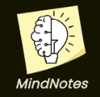
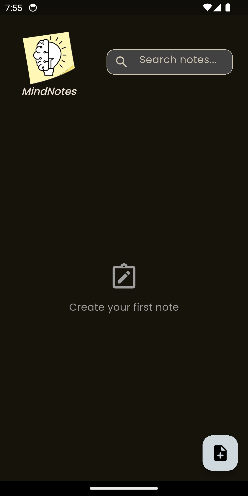
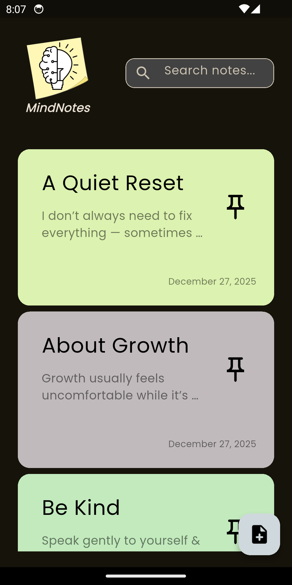

# 📝 MindNotesApp

[](https://flutter.dev/)
[](https://dart.dev/)
[](LICENSE)

<table>
<tr>
<td width="150">
  
</td>
<td>
  <p>
    <strong>MindNotesApp</strong> is a Flutter notes-taking application that allows users to quickly create, edit, delete, search, pin, and organize notes with a smooth & intuitive experience.<br>
    The app features a clean UI, offline storage using Hive, and state management using Bloc.
  </p>
</td>
</tr>
</table>

## Table of Contents
- [Features](#features)
- [Demo](#demo)
- [Tech Stack](#tech-stack)
- [Installation](#installation)
- [Future Updates](#future-updates)
- [Acknowledgements](#acknowledgements)
- [License](#license)


## Features

✔ Create and save notes  
✔ Edit existing notes  
✔ Delete notes with swipe (Dismissible)  
✔ Undo deletion to restore notes  
✔ Pin & unpin important notes  
✔ Search notes by title or content  
✔ Search results prioritize pinned notes  
✔ Smooth & responsive UI  
✔ Offline storage using Hive   


## Demo

### 🟡 Home Screen

<div align="center">
     
</div>

### 💡 Create & Edit Notes

<div align="center">
  
  | Create a Note | Edit a Note | Pin Notes |
  |---------------|-----------|-----------|
  | | | |
</div>

### 🔍 Search Feature

<div align="center">
  
</div>

### 🗑 Swipe to Delete + Undo

<div align="center">
  
</div>


## Tech Stack

- **Flutter & Dart** – UI & app logic  
- **Bloc / flutter_bloc** – State management
- **Hive & hive_flutter** – Local offline storage
- **Dismissible** – Swipe to delete
- **intl** – Date formatting
- **Custom Fonts & Icons** – Poppins + Cupertino Icons
- **Launcher Icons** – flutter_launcher_icons


## Installation


```bash
git clone https://github.com/YOUR_USERNAME/MindNotes.git
cd MindNotesApp
flutter pub get
flutter run
```

## Future Updates

- Categorize notes with tags  
- Note color customization  
- Dark / Light theme  
- Reminders & notifications  
- Cloud sync  
- Multi-language support  


## Acknowledgements

- [Eng.Tharwat Samy](https://github.com/tharwatsamy) – for their excellent course on Flutter development that guided me through building MindNotesApp 
- Flutter community & Bloc documentation
- Hive documentation
- UI inspiration from modern note-taking apps

## License

This project is licensed under the MIT License - view the [LICENSE](LICENSE) file for details.
